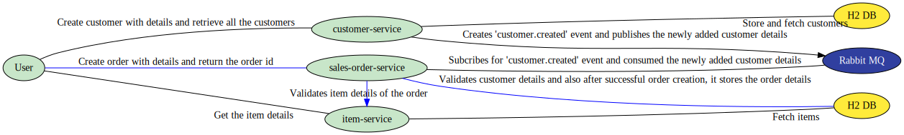

# Overview

## Case Study

This is a retail sales store case study which involves 3 microservices and they are implemented in Spring Boot. Spring Validation is performed for all the input fields. The services are deployed to Pivotal Cloud Foundry. They are enabled with Swagger UI for API testing.

### [Customer Service](customer-service-core.md)

1. Creates customer with the given details and triggers an event "customer.created" which is subscribed by Sales Order Service
2. Returns all the existing customers with their details

Table:

1. Customer – id, email, first\_name, last\_name 

### [Item Service](item-service-core.md)

1. Returns existing item details if the item name is sent as an input
2. Returns all the existing items with their details

Table:

1. Item – id, name, description, price 

### [Sales Order Service](sales-order-service-composite.md)

1. Subscribes the event "customer.created" and stores the received customer details in its own table named “Customer\_SOS”
2. Creates an order and returns the order id
   1. Validates customer by verifying the table “Customer\_SOS” with cust\_id
   2. Validates items by calling item service with item name
   3. Creates the order by inserting the order details in "sales\_order" table, and items of the order are stored in the "order\_line\_item" table

Input: Order Description, Order Date, customer id, list of item names

Tables:

1. sales\_order – id, order\_date, cust\_id, order\_desc, total\_price
2. order\_line\_item – id, item\_name, item\_quantity, order\_id

