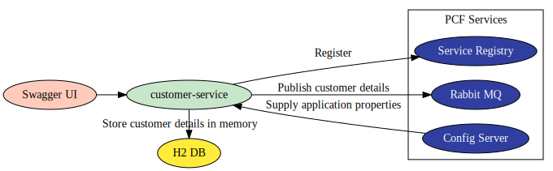

# Customer Service \(Core\)

## Architecture

**Source**: [https://github.com/microservices-api-case-study/customer-service](https://github.com/microservices-api-case-study/customer-service)

**Swagger PCF App URL:** [http://anand-customer-service.cfapps.io/swagger-ui.html](http://anand-customer-service.cfapps.io/swagger-ui.html)

**PCF Logs:** [https://console.run.pivotal.io/organizations/.../spaces/.../applications/.../logs](https://console.run.pivotal.io/organizations/7759b839-ab2d-4c00-9bd9-83a5c8a2e18e/spaces/8d628c1f-6db0-44bc-87f3-68225cdb96d4/applications/41190c85-ed58-423c-a026-2ff233b2c8c1/logs)

**REST API Calls:**

1.     getAllCustomers- GET - [http://anand-customer-service.cfapps.io/service1/customers](http://anand-customer-service.cfapps.io/service1/customers)

2.     addCustomer - POST - [http://anand-customer-service.cfapps.io/service1/customer](http://anand-customer-service.cfapps.io/service1/customer) 

**Jacoco Code Coverage Report:** [http://anand-customer-service.cfapps.io/jacoco/index.html](http://anand-customer-service.cfapps.io/jacoco/index.html)

